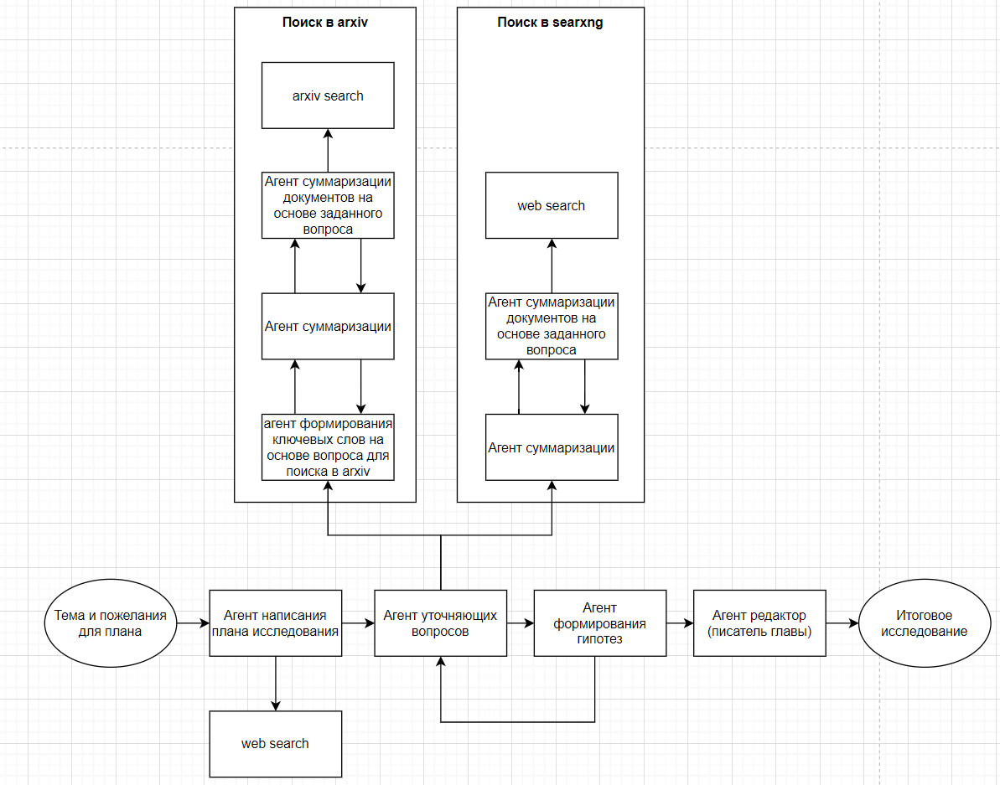

# Ход ресерча

1. Просмотрел видео [openai](https://www.youtube.com/watch?v=YkCDVn3_wiw&ab_channel=OpenAI)
   1. Надо добавить уточняющие вопросы
2. Посмотрел видео [опенсоурс deep research](https://www.youtube.com/watch?v=2mSNIX-l_Zc&ab_channel=LangChain)
   1. Спросить как можно улучшить содержание.

оценка
* https://arxiv.org/abs/2502.20309
* https://arxiv.org/abs/2502.14499

https://mirror-feeling-d80.notion.site/Deep-Research-18f808527b17803b809af5e42f81f5fc

# Выбор архитектуры deep-research
## Существующие решения

Ниже представлен список ссылок на различные open-source реализации deep-research у каджой из которых есть свои особенности,
которые хотелось бы разобрать.

### [Open Deep Research от Langchain AI](https://github.com/langchain-ai/open_deep_research)

Open Deep Research от Langchain AI имеет ключевую особенность - составление плана (структуры) и уточнение ее пользователем до начала исследования. 
В других решениях LLM сама генерирует структуру финального отчета уже после исследований.
После составления плана агент в цикле для каждой главы производит поиск релевантной информации в интренете и на основе нее пишет контент.
Далее проверяет насколько хорошо раскрыта тема и генерирует дополнительные вопросы. После выхода из цикла написанные главы подаются 
в качестве контекста для написания глав, не требующих прямых исследований (например введение и заключение). 
В итоге пользователю отдается сконкатенированный текст иследования.

### [Deep Research от dzhng](https://github.com/dzhng/deep-research)

Deep Research от dzhng предлагает вынести глубину (количество итераций поиска в интернете) и ширину 
(количество поисковых запросов, сгенерированных из знаний) поиска вынеси в качестве гиперпараметров.

### [Open Deep Research от huggingface](https://huggingface.co/blog/open-deep-research)

Open Deep Research от huggingface выделяется на фоне других архитектур использованием кодового агента, мыслящего посредством
написания кода и его исполнения. Так как код специально разработан для выражения сложных последовательностей действий, 
а LLM видела много кода при обучении, то закономерно получем прирост в метриках. 
По словам huggingface такой подход позволяет сократить количество токенов для генерации итогового отчета на 30%.

### [Graph of AI Ideas](https://arxiv.org/abs/2503.08549)

Подход Graph of AI Ideas предлагает строить граф на основании того какая статья на какой статье основывалась и 
определять тренды для отобранной подвыборки путей в графе. А затем исходя их трендов генерировать идеи.

### [The AI Scientist](https://arxiv.org/abs/2408.06292)

Писатели статьи The AI Scientist так же дополнительно к общему пайплайну 
добавляют среду проведения экспериментов (обычно ядро python) и ведение  журнала экспереиментов.

### [Reasoning LLMs with Tools for the Deep Research](https://arxiv.org/abs/2502.04644)

Главная идея: интегрировать инструмены веб поикса, исполнения кода и mind map прямо во время рассуждений модели, сразу же подставляя результат вызова инструмента.

### Достойные упоминания

*  [DeepSearcher от Milvus](https://milvus.io/ru/blog/introduce-deepsearcher-a-local-open-source-deep-research.md)
*  [Local Deep Research от Langchain AI](https://github.com/langchain-ai/local-deep-researcher)
*  [Open Deep Research от btahir](https://github.com/btahir/open-deep-research)

## Выбранная архитектура

### 

###  Тема исследования или полноценный план?

В вышеупомянутых архитектурах присутствует либо четкое следование плану исследования, 
либо план генерируется на лету по итогам исследования. 
Первый подход грозит ошибками, в случае если план исследования противоречит фактам, полученным в ходе исследования.
Второй вариант дает слишком большую свободу агенту. Поэтому принято решение оставить формирование плана, 
но добавить механизм рефлексии над планом и его корректировки через вопрос пользователю.

###  Конфигурирование глубины и ширины исследований

Хорошо когда мозгом агента выступает одна из передовых LLM. Она сможет с высокой точностью оценивать полноту расскрытия темы
и качество исследования. Но в других случаях модели могут ошибиться или даже захотеть дальше исследовать тему. Исходя из этого
выведем в гиперпараметры минимальную и максимальую глубину и ширину исследования.

###  Code Agent

Кодовый агент дает хороший прирост качества в областях математики и программирования. Добавим его в будующих версиях системы.

###  Как извлекать знания и формулировать гипотезы?

Извлекать знания будем путем суммаризации документов с учетом вопроса.
Гипотезы будем формулировать на основе списка summary по каждому уточняющему вопросу.

###  Итоговая архитектура

####  Схема агентов

####  Схема пайплайна

# Установка

разрешить докеру использовать гпу sudo apt-get update && sudo apt-get install -y nvidia-container-toolkit

