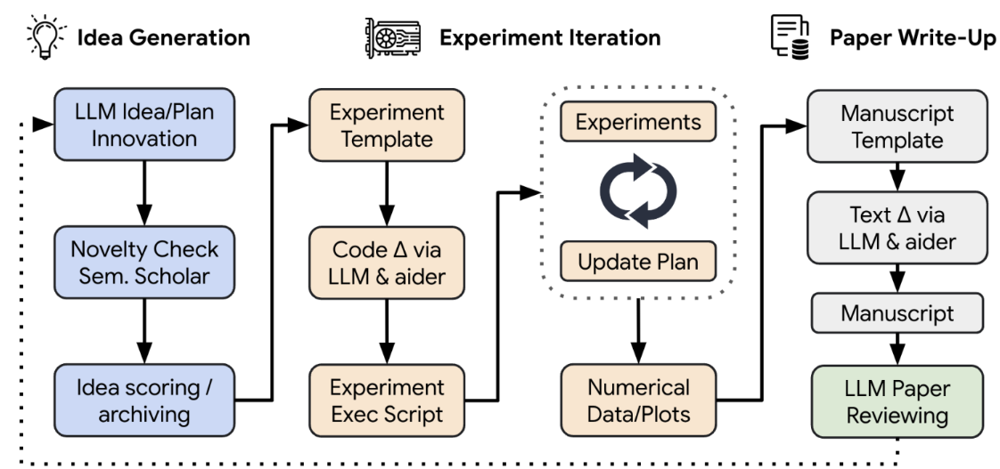

# Выбор архитектуры deep-research
## Существующие решения

Ниже представлен список ссылок на различные open-source реализации deep-research у каджой из которых есть свои особенности,
которые хотелось бы разобрать.

### [Open Deep Research от Langchain AI](https://github.com/langchain-ai/open_deep_research)

Open Deep Research от Langchain AI имеет ключевую особенность - составление плана (структуры) и уточнение ее пользователем до начала исследования.
В других решениях LLM сама генерирует структуру финального отчета уже после исследований.
После составления плана агент в цикле для каждой главы производит поиск релевантной информации в интренете и на основе нее пишет контент.
Далее проверяет насколько хорошо раскрыта тема и генерирует дополнительные вопросы. После выхода из цикла написанные главы подаются
в качестве контекста для написания глав, не требующих прямых исследований (например введение и заключение).
В итоге пользователю отдается сконкатенированный текст иследования.

### [Deep Research от dzhng](https://github.com/dzhng/deep-research)

Deep Research от dzhng предлагает вынести глубину (количество итераций поиска в интернете) и ширину
(количество поисковых запросов, сгенерированных из знаний) поиска вынеси в качестве гиперпараметров.

### [Open Deep Research от huggingface](https://huggingface.co/blog/open-deep-research)

Open Deep Research от huggingface выделяется на фоне других архитектур использованием кодового агента, мыслящего посредством
написания кода и его исполнения. Так как код специально разработан для выражения сложных последовательностей действий,
а LLM видела много кода при обучении, то закономерно получем прирост в метриках.
По словам huggingface такой подход позволяет сократить количество токенов для генерации итогового отчета на 30%.

### [Graph of AI Ideas](https://arxiv.org/abs/2503.08549)

Подход Graph of AI Ideas предлагает строить граф на основании того какая статья на какой статье основывалась и
определять тренды для отобранной подвыборки путей в графе. А затем исходя их трендов генерировать идеи.

### [The AI Scientist](https://arxiv.org/abs/2408.06292)

Писатели статьи The AI Scientist так же дополнительно к общему пайплайну
добавляют среду проведения экспериментов (обычно ядро python) и ведение  журнала экспереиментов.

### [Reasoning LLMs with Tools for the Deep Research](https://arxiv.org/abs/2502.04644)

Главная идея: интегрировать инструмены веб поикса, исполнения кода и mind map прямо во время рассуждений модели, сразу же подставляя результат вызова инструмента.

### Достойные упоминания

*  [DeepSearcher от Milvus](https://milvus.io/ru/blog/introduce-deepsearcher-a-local-open-source-deep-research.md)
*  [Local Deep Research от Langchain AI](https://github.com/langchain-ai/local-deep-researcher)
*  [Open Deep Research от btahir](https://github.com/btahir/open-deep-research)

## Выбранная архитектура

###  Инструменты для сбора данных

Для реализации с учетом ограничений в 1 неделю принято добавить только основные источники сбора данных.
* Web поиск
* Поиск научных статей arxiv
* Парсинг pdf файлов

###  Тема исследования или полноценный план?

В вышеупомянутых архитектурах присутствует либо четкое следование плану исследования,
либо план генерируется на лету по итогам исследования.
Первый подход грозит ошибками, в случае если план исследования противоречит фактам, полученным в ходе исследования.
Второй вариант дает слишком большую свободу агенту. Поэтому принято решение оставить формирование плана,
но в формирование плана добавить инструмент первичной оценки темы исследования.

###  Конфигурирование глубины и ширины исследований

Хорошо когда мозгом агента выступает одна из передовых LLM. Она сможет с высокой точностью оценивать полноту расскрытия темы
и качество исследования. Но в других случаях модели могут ошибиться или даже захотеть дальше исследовать тему. Исходя из этого
выведем в гиперпараметры глубину и ширину исследования.

###  Code Agent

Кодовый агент дает хороший прирост качества в областях математики и программирования. Добавим его в будующих версиях системы.

###  Как извлекать знания и формулировать гипотезы?

Извлекать знания будем путем суммаризации документов с учетом вопроса.
Гипотезы будем формулировать на основе списка summary по каждому уточняющему вопросу.

###  Итоговая схема агентов

###  Итоговая схема верхнеуровневого пайплайна

## Фреймворк управления агентами

Выбор пал на [openai-agents-sdk](https://openai.github.io/openai-agents-python/). Его ключевыми особенностями являются:
* Разработан opeanai недавно, но написан с учетом исправления недостатков сущестующих агентских фреймворков. 
* Простота в освоении - достаточно функционала, для различных кейсов использования, но при небольшое количество абстракций, чтобы быстро освоить.
* Придерживатеся подхода python first
* Имеется поддержка тарссировки запросов к агентам из коробки для большого количества observability поставщиков.

## AI Observability and Evaluation
В качестве отслеживания генераций агентов решено использовать [Arize Phoenix](https://docs.arize.com/phoenix)
как open source решение, предоставляющее возможность развернуть сбор метрик и запросов локально. В качестве
хранилища данных выступает Postgresql.

## Поисковый движок

В качестве поискового движка выбран [**SearXNG**](https://docs.searxng.org/).
Он выделяется среди мета-поисковых систем благодаря следующим особенностям:

* **Конфиденциальность**: не хранит информацию о пользователях и удаляет личные данные из запросов, отправляемых к другим поисковым сервисам.

* **Возможность самостоятельного хостинга**: можно развернуть собственный экземпляр системы и настроить под свои потребности для полного контроля над процессом поиска.

* **Широкий охват источников**: он агрегирует результаты из более чем 70 различных поисковых систем и баз данных, обеспечивая разнообразие информации.

## Выбор парсера PDF
По итогам исследований бесплатных opensource pdf парсеров устроил Marker-pdf
* Высокая точность и скорость: Согласно бенчмаркам, marker-pdf превосходит конкурентов по точности и скорости обработки. Например, среднее время обработки одной страницы составляет 2,838 секунды, а оценка точности по эвристике — 95,67, что выше, чем у Llamaparse и Mathpix.
* Поддержка различных типов документов и языков: Инструмент способен обрабатывать научные статьи, книги, формы, презентации и другие типы документов на всех языках.
* Форматирование сложных элементов: Marker-pdf корректно обрабатывает таблицы, формы, уравнения, встроенную математику, ссылки, сноски и блоки кода, обеспечивая точное воспроизведение структуры исходного документа.
* Извлечение и сохранение изображений: Инструмент может извлекать изображения из PDF-файлов и сохранять их отдельно, что полезно для дальнейшего использования.
* Удаление артефактов: Marker-pdf способен удалять заголовки, колонтитулы и другие артефакты, улучшая качество конечного результата.
* Интеграция с большими языковыми моделями (LLM): Опционально можно повысить точность обработки с помощью LLM, таких как Gemini, что улучшает обработку сложных элементов, например, объединение таблиц через страницы и форматирование встроенной математики.
* Гибкость в использовании оборудования: Marker-pdf работает на GPU, CPU или MPS, позволяя пользователям выбирать наиболее подходящую конфигурацию для своих ресурсов.

## Поддерживаемые LLM
Данное решение может работать с любым поставщиком LLM, совместимым с OpenAI Completions API и поддерживающим function calling и structured outputs.

## UI
Для UI выбран простой и понятный фреймворк gradio.

##  Схема системной архитектуры

## Проблемы с которыми столкнулся в ходе разработки и как можно улучшить систему
В ходе разработки и использовании небольших глупых LLM тяжело оценить насколько система хорошо работает. 
Так же она неплохо нагружает компьютер и потребляет много ОЗУ, за счет одновременной работы всех сервисов.
В идеале при раскатке разнести системые компоненты по разным нодам. Можно больше времени уделить prompt engineering, 
добавить few-shot примеров для повышения качества решаемых агентами задач. Дополнительно имеет место добавление 
поддержки ряда других поисковых систем научной и около научной направленности.

