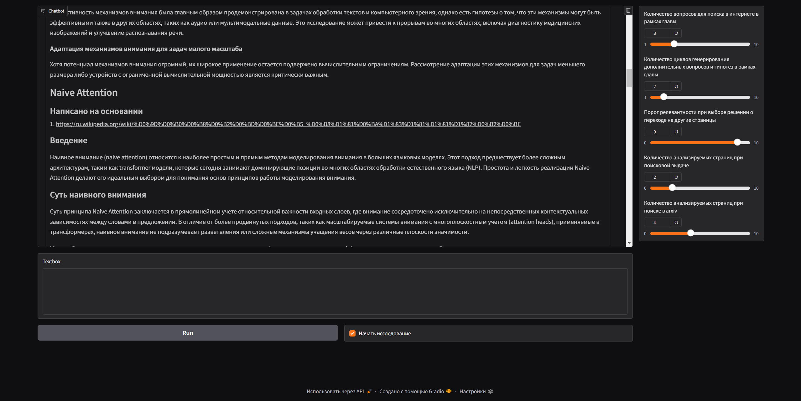

# Deep Research
Этот репоизиторий представляет собой open-source аналог системы deep research от OpenAI, который позволяет писать исследования
на различные темы. Проект использует библиотеку openai-agents, arize-phoenix для трассировки. В качестве инструментов поиска 
релевантной информации выступают: 
* searxng для поиска в интернете 
* arxiv для поиска научных статей
* marker-pdf для парсинга PDF

Система поддерживает настройку такхи параметров как
* Количество вопросов для поиска в интернете в рамках написания одной главы
* Количество циклов генерирования дополнительных вопросов и гипотез в рамках одной главы
* Порог релевантности при выборе решении о переходе на другие web страницы
* Количество анализируемых страниц при поисковой выдаче
* Количество анализируемых статей при поиске в arxiv

## Схема верхнеуровневого пайплайна 

* [Полный обзор преимуществ архитектуры и ход мыслей разработчика (click)](https://github.com/Emilmeister/deep-research/blob/master/docs/research.md)
* [Идейные подходы к оцениванию системы (click)](https://github.com/Emilmeister/deep-research/blob/master/docs/evaluation.md)

## Gradio UI
#### Пример создания оглавления работы

#### Часть итоговой работы


#### [Пример того как система справляется с исследованием (click)](https://github.com/Emilmeister/deep-research/blob/master/docs/examples/gbm_research.md)

## Развертывание системы

### Требования
Ключ провайдера LLM совместимый с OpenAI Completions API.

Для развертывания c использованием CPU
* ОЗУ 16 Гб 

Для развертывания c использованием CPU и GPU
* ОЗУ 12 Гб
* Видеокарта Nvidia поддерживающая CUDA с 8Гб

### Развертывание

Клонируем проект

```
git clone https://github.com/Emilmeister/deep-research.git
cd deep-research/system
```

Указать в deep-research/system/docker-compose.yml переменные окружения для подключения к LLM провайдеру
- OPENAI_API_KEY=...
- OPENAI_API_URL=http://...:11434/v1
- DEFAULT_MODEL=...

Разрешить docker использовать GPU

```
sudo apt-get update && sudo apt-get install -y nvidia-container-toolkit
```
Затем
```
sudo docker compose up -d
```
Ждем когда скачаются и соберуться образы. После запуска переходим по ссылке http://localhost:7860


